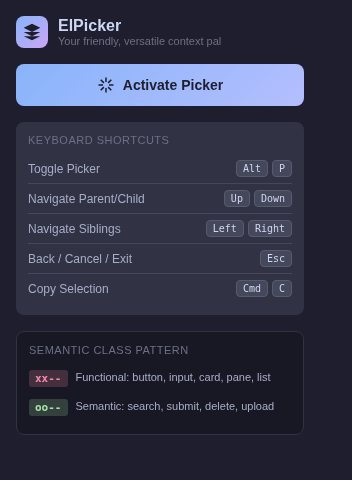
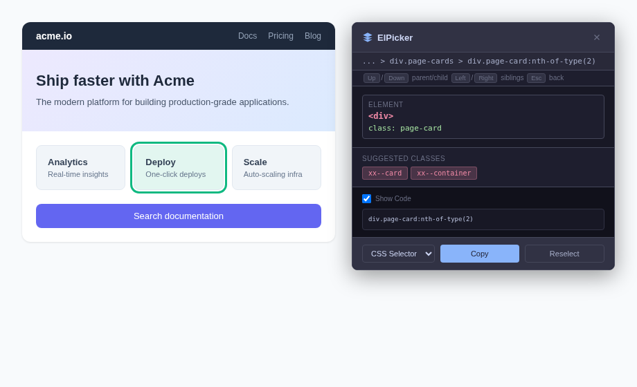

# ElPicker

Chrome extension for selecting and inspecting DOM elements with precision. Click or rectangle-drag to pick elements, navigate the DOM tree with arrow keys, and copy context as CSS selectors, XPath, or raw HTML. Also suggests semantic class names based on element purpose.

| Popup | Overlay in action |
|-------|-------------------|
|  |  |

## What It Does

ElPicker injects a lightweight picker into any web page. Activate it with **Alt+P** (or the toolbar button), then click or drag a rectangle to select an element. An overlay shows the element's tag, id, classes, a breadcrumb trail, and a code preview. Arrow keys let you walk the DOM — up/down for parent/child, left/right for siblings — so you can zero in on exactly the element you need without opening DevTools.

### Use Cases

- **Grabbing selectors for scraping or automation** — select an element, copy its CSS selector or XPath, paste it into Puppeteer, Playwright, or an n8n HTTP node
- **Debugging layout issues** — visually pick elements and inspect their tag/class/id hierarchy without digging through the Elements panel
- **Building test locators** — navigate to the right element with arrow keys and copy a stable selector for your test suite
- **Naming CSS classes** — ElPicker suggests semantic class names (`xx--button`, `oo--search`) based on element tag, role, and text content, useful when refactoring markup
- **Quick context extraction** — copy inner or outer HTML of a component to paste into docs, tickets, or AI prompts
- **Learning page structure** — the breadcrumb and DOM navigation make it easy to understand how an unfamiliar page is put together

## Local Setup

The extension has two parts: the Chrome extension itself (vanilla JS, no build step) and a Next.js companion app (for the settings/docs UI).

### Load the Extension in Chrome

1. Clone the repo:
   ```bash
   git clone https://github.com/kenlane33/el-picker.git
   cd el-picker
   ```

2. Open `chrome://extensions/` in Chrome.

3. Enable **Developer mode** (top right toggle).

4. Click **Load unpacked** and select the `el-picker` root folder.

5. Pin the ElPicker icon in the toolbar. Press **Alt+P** on any page to activate.

### Run the Companion App (optional)

```bash
pnpm install
pnpm dev
# visit http://localhost:3000
```

## Publishing

### Chrome Web Store

1. Build the extension zip:
   ```bash
   pnpm build:extension
   # or directly: bash build-extension.sh
   ```
   This creates `dist/el-picker.zip` containing only the extension files (no Next.js app, no node_modules).

2. Go to the [Chrome Developer Dashboard](https://chrome.google.com/webstore/devconsole).

3. Click **New Item**, upload `dist/el-picker.zip`, fill in the listing details (description, screenshots from `screenshots/`, category = Developer Tools), and submit for review.

4. After approval the extension will be live on the Chrome Web Store.

### Cloudflare Pages (Companion App)

If you want to host the Next.js companion app:

#### Option A: Git-push CI

1. In [Cloudflare Dashboard → Pages](https://dash.cloudflare.com/?to=/:account/pages), click **Create a project → Connect to Git**.
2. Select the `kenlane33/el-picker` repo.
3. Configure the build:
   - **Framework preset:** Next.js
   - **Build command:** `pnpm build`
   - **Build output directory:** `.next`
4. Save and deploy. Pushes to `main` will auto-deploy.

> **Note:** This deploys the companion web app, not the extension itself. The extension is distributed through the Chrome Web Store. Whether CI on Cloudflare is worth it depends on how actively the companion app changes — for a mostly-static docs/settings page it may be overkill.

#### Option B: Wrangler CLI

```bash
npm install -g wrangler
wrangler login

pnpm build
wrangler pages deploy .next --project-name=el-picker
```
